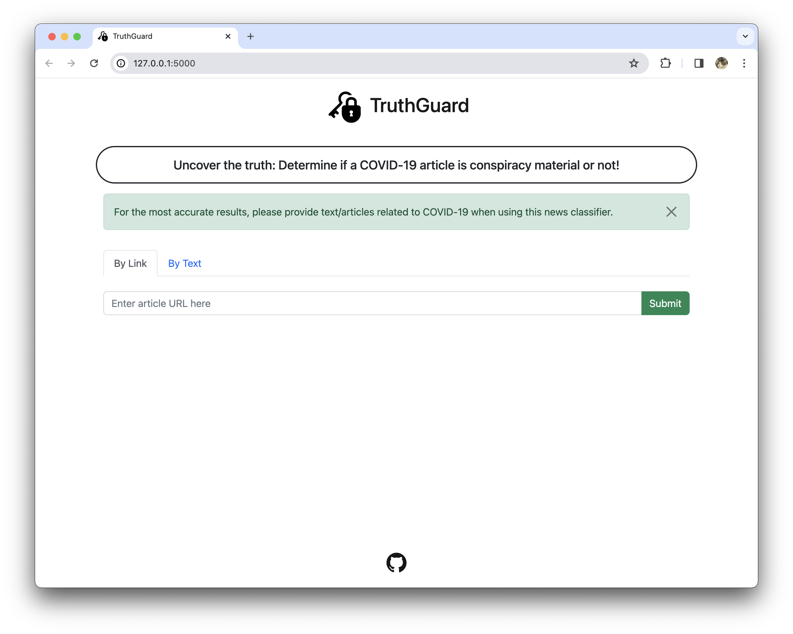
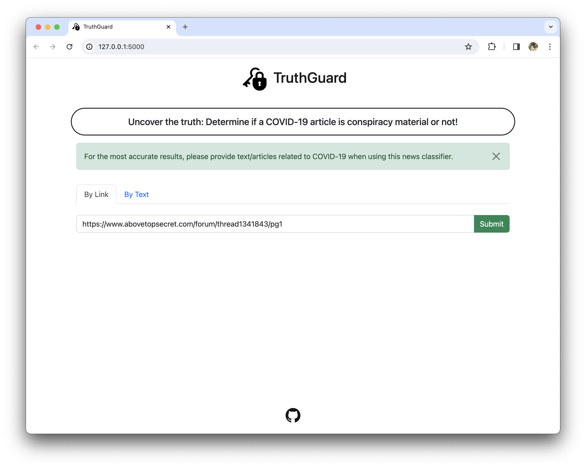
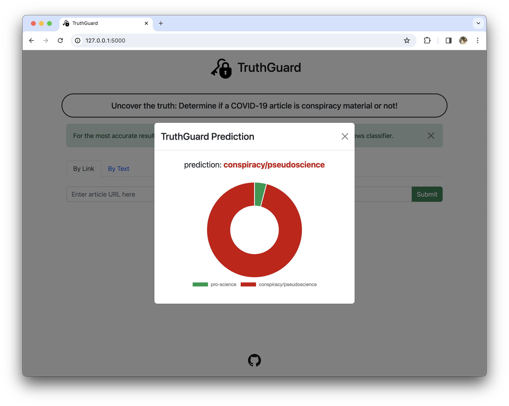
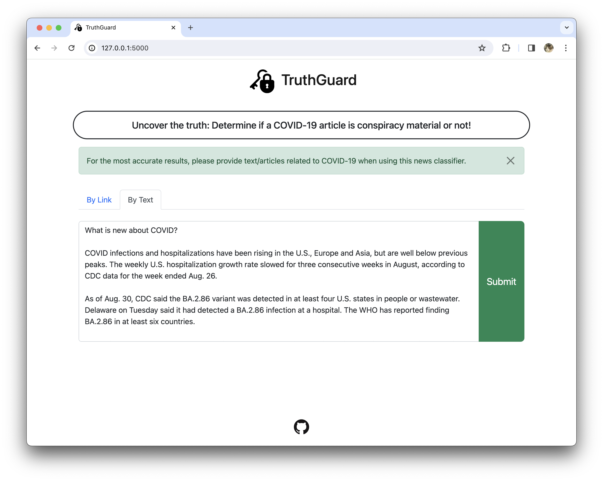
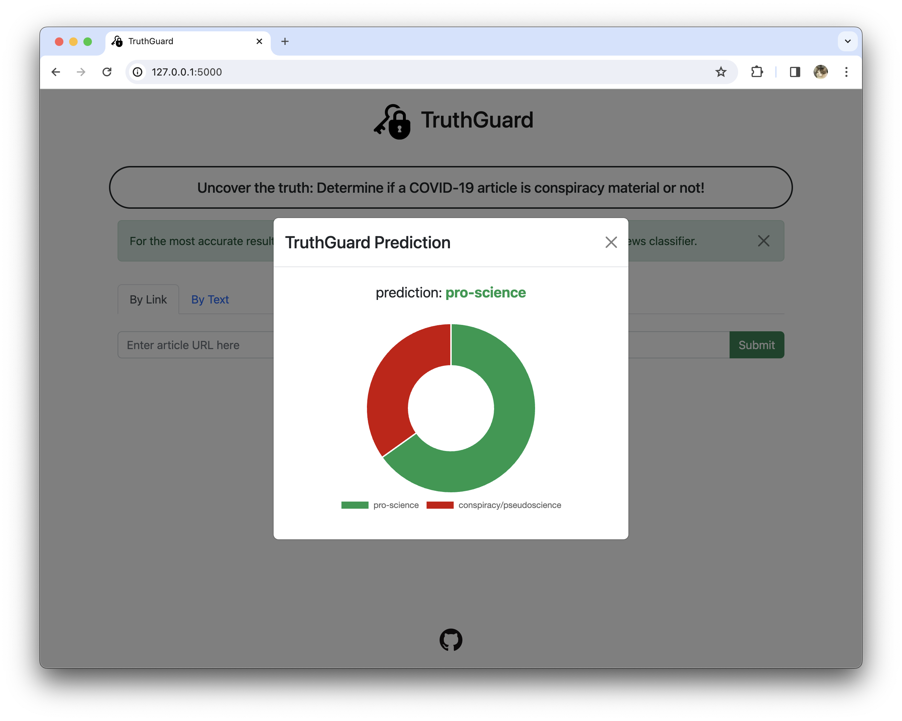

# TruthGuard :safety_vest:

- [Demo](#demo)
   - [Home Page](#home-page)
   - [Generating a Prediction using Article URL](#generating-a-prediction-using-article-url)
   - [Generating a Prediction from Article Text](#generating-a-prediction-from-article-text)
- [Tools Used](#tools-used)
- [Methodology](#methodology)

----

Embark on an unprecedented journey of discernment with TruthGuard, a Python NLP project designed to classify COVID-19 news content. Equipped to distinguish between pro-science facts and conspiracy theories, TruthGuard stands as a pivotal tool in the fight against misinformation during these challenging times.

## Demo

### Home Page

### Generating a Prediction using Article URL

### Generating a Prediction from Article Text 

source for text: [Reuters](https://www.reuters.com/business/healthcare-pharmaceuticals/do-i-need-worry-about-covid-again-2023-09-07/)

## Tools Used:
- pre-trained ''word2vec-google-news-300'' **Word2Vec** model: for generating meaningful word embeddings
- **Sci-kit Learn** Library: to train various machine learning models.
- **Spacy** package: utilized for advanced text processing.
- **Pandas** & **Matplotlib**: for data manipulation and visualization
- **Chart.js**: for visualizing prediction data
- **Regular Expressions**: for cleaning and preparing the textual data.
- **Beautiful Soup**: for intelligent parsing of web scrapage.
- **Newspaper3k** package: to extract complete news articles.

## Methodology
My journey began with using MediaBiasFactCheck's classifications as a guide to target websites flagged as pro-science or conspiracy-themed. I developed a custom "searcher" scraper, empowered by Beautiful Soup, to extract metadata about the latest COVID-19 articles from these sites.

Next, the Newspaper3k module came into play, retrieving the full text of the articles deemed relevant. Following this, our dataset underwent rigorous processing. We employed the Spacy module and regular expressions to refine our textual data, removing extraneous elements like dates, links, and stop words, and performing lemmatization for a cleaner, more analyzable text.

We then harnessed the power of the state-of-the-art 'word2vec-google-news-300' Word2Vec model, generating precise word embeddings for each article. This key step utilized a model trained on news articles, ensuring high relevance and accuracy in understanding the nuances of our dataset.

Finally, we split our data into training and test sets. Various machine learning models from the Sci-kit Learn library - including Logistic Regression, Support Vector Machine, Linear Discriminant Analysis, Naive Bayes, and Decision Tree Classifier - were trained, tested, and evaluated to achieve optimal classification performance.

TruthGuard stands as a testament to the power of combining advanced NLP techniques and machine learning to illuminate the truth in a world overwhelmed with misinformation.
